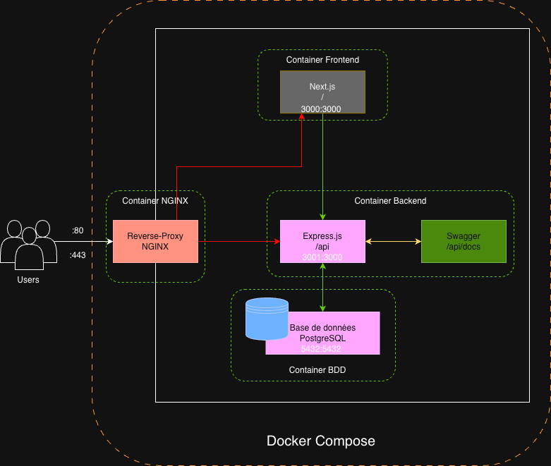
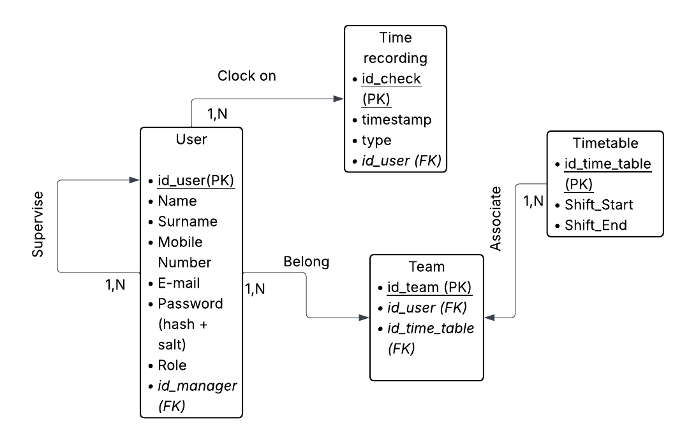

# 🕒 Bootstrap TIME MANAGER

**Bootstrap TIME MANAGER** est une application web de badgeuse permettant aux utilisateurs d’enregistrer, suivre et gérer leurs heures de travail en toute simplicité.  

Le projet est construit sur une architecture moderne et scalable comprenant un **back-end en Express.js**, un **reverse-proxy sous NGINX**, une **base de données PostgreSQL**, un **front-end en Next.js**, le tout **conteneurisé avec Docker** et documenté via **Swagger**.

---

## 📚 Table des matières

- [🕒 Bootstrap TIME MANAGER](#-bootstrap-time-manager)
  - [📚 Table des matières](#-table-des-matières)
  - [📄 Introduction](#-introduction)
  - [🏗️ Architecture globale](#️-architecture-globale)
    - [🔄 Schéma général](#-schéma-général)
  - [⚙️ Choix techniques](#️-choix-techniques)
  - [| **Swagger** | Documentation interactive, communication facilitée |](#-swagger--documentation-interactive-communication-facilitée-)
  - [📁 Structure du projet](#-structure-du-projet)
  - [📡 Back-end – Express.js](#-back-end--expressjs)
    - [🔌 Endpoints principaux](#-endpoints-principaux)
    - [🛡️ Middleware recommandés](#️-middleware-recommandés)
  - [🗃️ Base de données – PostgreSQL](#️-base-de-données--postgresql)
    - [🧱 Modélisation / 🔗 Relations](#-modélisation---relations)
  - [🖥️ Front-end – Next.js](#️-front-end--nextjs)
    - [📑 Pages principales](#-pages-principales)
    - [🧠 Gestion d’état](#-gestion-détat)
    - [🔐 Authentification](#-authentification)
  - [📦 Dockerisation](#-dockerisation)
  - [🚀 Commandes utiles](#-commandes-utiles)
  - [📜 Documentation API – Swagger](#-documentation-api--swagger)
  - [🧪 Tests et Qualité](#-tests-et-qualité)
  - [🚀 Déploiement](#-déploiement)
  - [📊 Conclusion \& Perspectives](#-conclusion--perspectives)
    - [🔮 Améliorations possibles :](#-améliorations-possibles-)
  - [📎 Annexes](#-annexes)

---

## 📄 Introduction

**Bootstrap TIME MANAGER** est une solution de gestion du temps destinée aux individus et aux équipes.  
Elle permet de :
- Enregistrer le temps passé en entreprise
- Visualiser des statistiques et rapports
- Gérer les utilisateurs et leur authentification

---

## 🏗️ Architecture globale

### 🔄 Schéma général



- **Frontend (Next.js)** : Interface utilisateur moderne et réactive  
- **Backend (Express.js)** : API RESTful sécurisée et extensible  
- **Base de données (PostgreSQL)** : Stockage fiable des données
- **NGINX** : Reverse-proxy pour la gestion des requêtes et la sécurité  
- **Swagger** : Documentation interactive de l’API  
- **Docker** : Conteneurisation pour un déploiement facile et portable

---

## ⚙️ Choix techniques

| Technologie    | Raison du choix |
|---------------|------------------|
| **Express.js** | Rapidité de développement, flexibilité et écosystème riche |
| **PostgreSQL** | Fiabilité, requêtes complexes, relations robustes |
| **Next.js** | Rendu côté serveur (SSR), SEO optimisé, architecture moderne |
| **Docker** | Environnements reproductibles, déploiement simplifié |
| **Swagger** | Documentation interactive, communication facilitée |
---

## 📁 Structure du projet

```
bootstrap-time-manager/
│
├── backend/
│ ├── src/
│ │ ├── routes/
│ │ ├── controllers/
│ │ ├── models/
│ │ ├── middleware/
│ │ └── index.js
│ ├── swagger/
│ ├── package.json
│ └── Dockerfile
│
├── frontend/
│ ├── pages/
│ ├── components/
│ ├── services/
│ ├── package.json
│ └── Dockerfile
│
├── database/
│ ├── init.sql
│ └── Dockerfile
│
├── docker-compose.yml
└── README.md
```

---

## 📡 Back-end – Express.js

Le backend fournit une API RESTful pour toutes les opérations.

### 🔌 Endpoints principaux
- `POST /auth/register` – Inscription d’un utilisateur  
- `POST /auth/login` – Authentification   
- `GET /time` – Historique du temps passé
- `GET /users` – Liste des utilisateurs (admin) 

### 🛡️ Middleware recommandés
- `cors` – gestion des origines  
- `helmet` – sécurité des headers  
- `morgan` – logs HTTP

---

## 🗃️ Base de données – PostgreSQL

### 🧱 Modélisation / 🔗 Relations



---

## 🖥️ Front-end – Next.js

### 📑 Pages principales
- `/login` – Authentification  
- `/dashboard` – Vue d’ensemble  
- `/stats` – Statistiques et graphiques  

### 🧠 Gestion d’état
- Context API ou Zustand / Redux

### 🔐 Authentification
- JWT stocké en cookies sécurisés
- Redirection conditionnelle côté serveur
- Protection des routes privées
- Gestion des rôles utilisateurs

---

## 📦 Dockerisation

## 🚀 Commandes utiles

```bash
docker-compose up --build
docker-compose down
```

---

## 📜 Documentation API – Swagger
Swagger est intégré directement dans le backend :
- URL d’accès : http://localhost:3001/api-docs

---

## 🧪 Tests et Qualité
- Tests unitaires : Jest
- Linting : ESLint + Prettier
- CI/CD : GitHub Actions

---

## 🚀 Déploiement
- Build frontend : ```npm run build```
- Lancer en production : ```docker-compose -f docker-compose.prod.yml up -d```
- Variables d’environnement : ```.env```

---

## 📊 Conclusion & Perspectives

Bootstrap TIME MANAGER offre une base solide pour toute application de gestion du temps passé en entreprise.

### 🔮 Améliorations possibles :
- Notifications en temps réel
- Intégration d’un calendrier
- Export PDF/CSV
- Application mobile

---

## 📎 Annexes
- 📦 Commandes utiles :

```bash
npm run dev          # Lancer en dev
npm run migrate      # Lancer les migrations
docker-compose logs  # Voir les logs
````

- 📚 Ressources recommandées :
* [Express.js Docs](https://expressjs.com/)
* [Next.js Docs](https://nextjs.org/docs)
* [PostgreSQL Docs](https://www.postgresql.org/docs/)
* [Swagger Docs](https://swagger.io/docs/)
